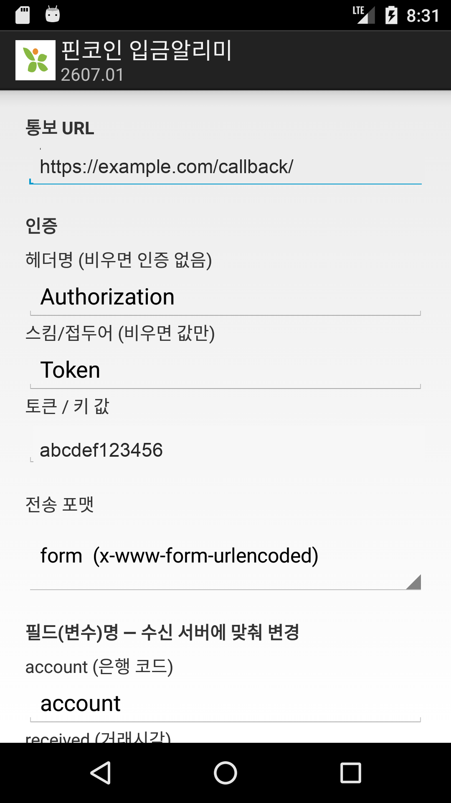

# 핀코인 입금알리미 (paynotify)

은행 입금 SMS를 수신·파싱해서 **원격 서버로 forwarding**하는 안드로이드 앱.
은행 문자가 아닌 SMS나 배터리/부팅 상태는 텔레그램으로 알린다.

> 패키지: `kr.co.pincoin.paynotify` · 전송/인증/필드는 **앱 설정 화면에서 런타임 구성**한다.

## 동작

```
은행 입금 SMS ──▶ Receiver(발신번호별 정규식 파싱) ──▶ PaymentNotifier ──▶ 원격 서버
그 외 SMS/상태 ─────────────────────────────────────▶ TelegramNotifier ─▶ 텔레그램
```

- 지원 은행(5): 국민(16449999) · 농협(15882100) · 신한(15778000) · 우리(15885000) · 기업(15662566)
- 분할(멀티파트) SMS는 모든 PDU를 이어붙여 파싱
- `BroadcastReceiver` + 코루틴 + `goAsync()` — `onReceive` 종료 후에도 전송 완료 보장

## 기술 스택

- Kotlin + Coroutines, AndroidX
- AGP 8.7.3 / Gradle 8.11.1 (빌드 JDK 17+)
- minSdk 23 · compileSdk/targetSdk 35

## 소스 구성 (`app/src/main/java/kr/co/pincoin/paynotify/`)

| 파일 | 역할 |
|---|---|
| `Receiver.kt` | SMS 수신·발신번호별 파싱·분기 (핵심) |
| `PaymentNotifier.kt` | 원격 서버 전송 (포맷/인증/필드명 적용) |
| `TelegramNotifier.kt` | 텔레그램 알림 (선택) |
| `AppConfig.kt` | 런타임 설정 저장소 (SharedPreferences) |
| `MainActivity.kt` | 설정 화면 + 배터리 최적화 예외 요청 |

## 설정 (런타임, 단말별)

앱 실행 → 설정 화면에서 입력 후 **저장**. 값은 앱 전용 로컬 저장소(SharedPreferences)에 보관되며
재빌드가 필요 없다. 수신 서버 구현(Django/Spring/FastAPI 등)에 맞춰 조정한다.

<p></p>

- **전송 URL**
- **인증**: 헤더명(예: `Authorization`, `X-API-Key`) + 스킴/접두어(`Token`/`Bearer`/`Basic` 또는 없음) + 토큰
  - 전송 헤더 = `헤더명: 스킴 토큰` (스킴 비면 값만, 헤더명 비면 인증 없음)
- **전송 포맷**: `form`(x-www-form-urlencoded) · `json` · `multipart`(form-data)
- **필드(변수)명**: account · received · name · method · amount · balance
- **텔레그램**: 봇 토큰 · 채널 ID (비우면 미사용)

> 빌드 디폴트는 **비어 있다**. 내부 운영값은 앱에 박지 않고 각 단말에서 입력한다.

## 통보 요청 예시 (curl)

파싱 결과가 아래처럼 통보 URL로 POST된다. **필드명·인증·포맷은 모두 설정값**이며,
예시는 기본 필드명과 아래 파싱 데이터 기준이다.

```
account=0  received=07/06 14:23  name=홍길동  method=입금  amount=10,000  balance=1,000,000
```

### 인증 헤더 (설정에 따라)

전송 헤더 = `헤더명: 스킴 토큰` (헤더명 비면 인증 없음, 스킴 비면 값만).

| 방식 | 헤더 | 헤더명 / 스킴 |
|---|---|---|
| DRF TokenAuth (기본) | `Authorization: Token abcdef123456` | `Authorization` / `Token` |
| JWT · OAuth2 (Bearer) | `Authorization: Bearer eyJhbGciOi...` | `Authorization` / `Bearer` |
| Basic | `Authorization: Basic dXNlcjpwYXNz` | `Authorization` / `Basic` |
| API Key 헤더 | `X-API-Key: abcdef123456` | `X-API-Key` / (없음) |
| 인증 없음 | (헤더 없음) | (헤더명 비움) |

### form (x-www-form-urlencoded)

```bash
curl -X POST 'https://example.com/callback/' \
  -H 'Authorization: Token abcdef123456' \
  -H 'Content-Type: application/x-www-form-urlencoded' \
  --data-urlencode 'account=0' \
  --data-urlencode 'received=07/06 14:23' \
  --data-urlencode 'name=홍길동' \
  --data-urlencode 'method=입금' \
  --data-urlencode 'amount=10,000' \
  --data-urlencode 'balance=1,000,000'
```

### json (application/json)

```bash
curl -X POST 'https://example.com/callback/' \
  -H 'Authorization: Token abcdef123456' \
  -H 'Content-Type: application/json; charset=UTF-8' \
  -d '{"account":"0","received":"07/06 14:23","name":"홍길동","method":"입금","amount":"10,000","balance":"1,000,000"}'
```

### multipart (form-data)

```bash
# curl -F 는 multipart/form-data 로 자동 전송 (boundary 자동 생성)
curl -X POST 'https://example.com/callback/' \
  -H 'Authorization: Token abcdef123456' \
  -F 'account=0' \
  -F 'received=07/06 14:23' \
  -F 'name=홍길동' \
  -F 'method=입금' \
  -F 'amount=10,000' \
  -F 'balance=1,000,000'
```

> 필드명을 바꾸면(예: `name` → `sender`) 키가 그대로 바뀐다. 헤더명/스킴을 `Bearer` 등으로
> 바꾸면 `Authorization: Bearer <토큰>` 으로 나간다.

## 빌드

```bash
cp gradle.properties.example gradle.properties   # 최초 1회, 서명 정보 입력
./gradlew :app:assembleDebug                      # 디버그 APK
./gradlew :app:bundleRelease                      # 서명된 release AAB
```

- `gradle.properties`(gitignore 대상)에는 **release 서명 정보**만 필요하다.
- 서명 키스토어(`app/release.jks`)와 비밀번호는 커밋되지 않으며 **안전하게 백업**해야 한다.

## 권한

`RECEIVE_SMS`, `READ_SMS`, `INTERNET`, `ACCESS_NETWORK_STATE`,
`RECEIVE_BOOT_COMPLETED`, `REQUEST_IGNORE_BATTERY_OPTIMIZATIONS`

> 단말이 상시 충전이 아니므로 배터리 최적화 예외 요청은 유지한다 (Doze로부터 백그라운드 수신 보호).

---

# 배포 — Android Management API 관리형 키오스크 단말

`RECEIVE_SMS`/`READ_SMS`를 사용하므로 **공개 Play Store 등록은 정책상 불가**하다
(기본 SMS 핸들러가 아닌 앱은 SMS 권한 심사에서 거부됨). B2B는 전용 단말(키오스크)로
`kr.co.pincoin.paynotify` 를 배포한다. [Android Management API](https://developers.google.com/android/management)
를 직접 연동하는 방식(무료)이며, 상용 EMM 없이 코드/REST 호출만으로 단말을 등록·잠금·관리한다.
관리형 Play 비공개 앱은 SMS 권한 예외 레인에 해당한다.

## 모델 — 관리형 단말 판매

앱이 아니라 **세팅된 전용 단말기**를 판다. 고객사 워크스페이스는 건드릴 필요 없다.

1. 판매용 폰을 **내 Enterprise(EMM/MDM)에 등록** — 이때 로그인되는 계정은 실 Workspace
   사용자가 아니라 **EMM 발급 기기 전용 관리형 Play 계정**(Gmail/Drive/SSO 접근 없음)
   → 단말을 넘겨도 계정으로 할 수 있는 일이 없다.
2. 앱을 **내 조직 전용 비공개 앱**으로 관리형 Play에 게시
3. MDM으로 **설치·자동 업데이트 원격 푸시** — '알 수 없는 출처' 토글 불필요
4. **키오스크 잠금** + 초기화/계정추가/USB 차단 + 원격 잠금·와이프

## 정책 요약 (`deploy/mdm/policy.json`)

| 항목 | 설정 | 의도 |
|---|---|---|
| `installType: KIOSK` | 이 앱만 실행되는 전용 모드 | 홈/다른 앱 차단, 자동 실행 |
| `permissionGrants` (SMS) | `RECEIVE_SMS`, `READ_SMS` = GRANT | 권한 팝업 없이 자동 승인 |
| `kioskCustomization` | 내비/상태바/설정 잠금 | 사용자가 못 빠져나감 |
| `factoryResetDisabled` 등 | 초기화·계정추가·USB·개발자옵션 차단 | 변조/이탈 방지 |
| `untrustedAppsPolicy: DISALLOW_INSTALL` | 외부 APK 설치 금지 | 다른 앱 못 넣음 |
| `stayOnPluggedModes` | 충전 중 화면 유지 | 상시 켜진 카운터 단말 |
| `autoUpdateMode: HIGH_PRIORITY` | 앱 자동 업데이트 | 원격 무중단 배포 |

## 사전 준비 (1회)

1. **GCP 프로젝트**에서 Android Management API 활성화
   ```
   gcloud services enable androidmanagement.googleapis.com
   ```
2. **서비스 계정** 생성 + 키 발급 (백엔드가 API 호출에 사용)
3. **Enterprise 생성** — 관리형 Play Accounts 엔터프라이즈 등록
   (signup URL 흐름 또는 `enterprises.create`). 결과로 `enterprises/LC0xxxxxxx` 이름을 받는다.
4. **비공개 앱 게시** — 관리형 Google Play(Play Console 비공개 앱 또는 게시 iframe)에
   `kr.co.pincoin.paynotify` 를 올려야 policy 의 packageName 이 설치 가능해진다.

## 정책 적용

`{enterpriseId}` 를 채우고 policy 를 생성/갱신한다 (REST):

```
PATCH https://androidmanagement.googleapis.com/v1/enterprises/{enterpriseId}/policies/paynotify-kiosk
Authorization: Bearer $(gcloud auth print-access-token)
Content-Type: application/json

<deploy/mdm/policy.json 내용>
```

> API 는 알 수 없는 필드를 거부하므로, 먼저
> [API Explorer](https://developers.google.com/android/management/reference/rest/v1/enterprises.policies/patch)
> 에서 검증하면 오타/필드명을 바로 잡을 수 있다.

## 단말 등록 (기기마다)

1. **Enrollment token 생성** — 위 정책을 참조:
   ```
   POST https://androidmanagement.googleapis.com/v1/enterprises/{enterpriseId}/enrollmentTokens
   {
     "policyName": "enterprises/{enterpriseId}/policies/paynotify-kiosk",
     "duration": "3600s"
   }
   ```
   응답의 `qrCode` 필드(JSON 문자열)를 QR 이미지로 렌더링.
2. **공장초기화된 새 단말** → 최초 설정 환영화면을 **6번 탭** → QR 스캐너 실행 → QR 스캔
   (또는 계정 입력란에 `afw#setup`).
3. 단말이 **fully-managed(디바이스 오너)** 로 프로비저닝 → 정책 자동 적용 → 앱 자동 설치·키오스크 진입.
4. 대량이면 **zero-touch enrollment** 로 개봉 즉시 자동 등록(제거 불가)하도록 리셀러 등록.

## 운영

- **상태 확인**: `enterprises.devices.list` / Pub/Sub 알림으로 온라인·앱버전·마지막 동기화 수신
- **원격 조치**: `enterprises.devices.patch` 로 `LOCK` / `RESET_PASSWORD`, `enterprises.devices.delete` 로 등록 해제·와이프
   → 미납/오남용/분실 시 즉시 무력화

## 대안 — 고객사 조직 ID 비공개 배포

고객사가 Android Enterprise를 쓰면, 내 Play Console에서 **고객사 Organization ID로만
비공개 게시**(최대 1000개 조직)해 고객이 자기 기기를 관리하게 할 수도 있다.

## 남은 캐비앗

- **배터리 최적화 예외 (유지 필수)**: 단말이 항상 충전 상태가 아니므로 Doze/앱 대기에서
  백그라운드 SMS 리시버가 죽을 수 있다. 따라서 `MainActivity` 의 배터리 최적화 예외 요청
  (`REQUEST_IGNORE_BATTERY_OPTIMIZATIONS`)은 **제거하지 말고 유지**한다. AMAPI 에 직접
  화이트리스트 필드는 없으므로 이 앱 내 예외 요청 흐름이 포워딩 신뢰성의 핵심이다.
- **FRP(공장초기화 보호)**: 강한 도난 방지가 필요하면 zero-touch 등록으로 기기를 조직에 묶는다.
